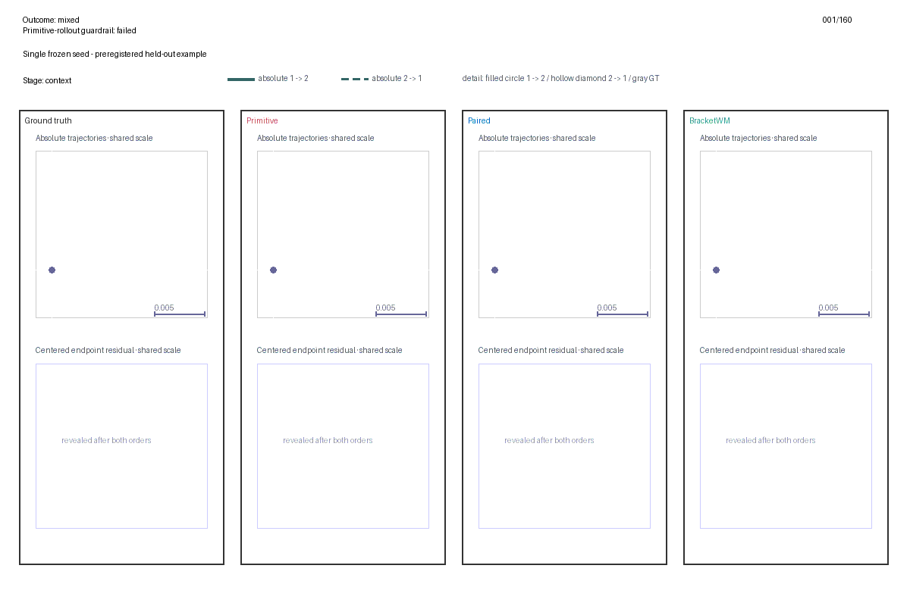
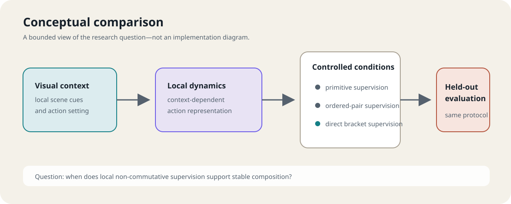
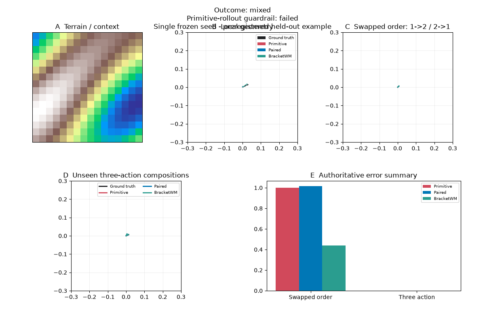

# BracketWM

> **Research showcase only. This is not an open-source release.**
>
> This repository is a limited demonstration supporting a research proposal.
> No permission is granted to reuse, modify, redistribute, commercialize,
> publish, sublicense, or incorporate its materials into another research
> project or publication without prior written authorization.

**Author:** Zhiyuan Deng  
**Date:** 26 July 2026  
**Status:** Research proposal showcase; preliminary controlled prototype



## Research question

Action effects can depend on both visual context and order: doing action A
before B need not produce the same local response as doing B before A. The
research question is whether directly supervising this local
non-commutativity helps a learned dynamics representation capture action
composition more faithfully than primitive-only or ordered-pair supervision.

BracketWM studies a context-conditioned local dynamics representation. A
visual context determines local action fields, while a reset-based
swapped-order intervention supplies a direct Lie-bracket signal: the leading
local term that distinguishes the two action orders.

The prototype compares three supervision conditions under controlled training
conditions. The comparison asks two separate questions: whether the local
order effect can be recovered, and whether that local information transfers
to stable composition beyond the directly supervised response.

## What this showcase is—and is not

This repository demonstrates that the research mechanism has been implemented,
exercised, and evaluated in a controlled prototype. It contains a conceptual
diagram, selected result visuals, and an independent CPU illustration of
order-dependent motion.

It does not contain the research implementation, training entry point,
experimental generator, learned artifacts, evaluation records, or the
end-to-end experiment. The standalone illustration below is intentionally
separate from the experiment.



## Preliminary result

The authoritative one-seed outcome is **mixed**. The most direct mechanism
measure is swapped-order error; lower is better.

| Supervision condition | Swapped-order error |
|---|---:|
| Primitive-only | 1.000000 |
| Ordered-pair | 1.015860 |
| BracketWM | 0.437972 |

With one frozen training seed, these values correspond to descriptive
reductions of approximately **56.2%** relative to primitive-only supervision
and **56.9%** relative to ordered-pair supervision.

Three qualitative conclusions follow:

1. Direct Lie-bracket supervision substantially improved swapped-order
   response recovery relative to both comparison conditions. This is
   preliminary evidence that it contributes a distinct, learnable geometric
   signal rather than merely duplicating ordered-pair supervision.
2. The local improvement did not transfer to unseen three-action composition.
   Local non-commutative recovery and stable multi-step compositional
   generalization therefore appear to be distinct problems.
3. The current joint objective did not preserve primitive-rollout fidelity.
   The resulting research question is how to integrate first- and second-order
   control geometry without destabilizing iterative dynamics.

The controlled comparison was internally validated on an NVIDIA RTX 4070 Ti.
Here, “internally validated” means that the predeclared comparison and its
internal consistency checks completed in the controlled research environment;
it is not a claim of statistical robustness or independent reproduction from
this showcase. The result is descriptive evidence from a single official run
with one frozen training seed.

This experiment does not establish that BracketWM solved compositional generalization.
It establishes feasibility, identifies a meaningful local signal, and exposes
a precise unresolved integration problem.



## Standalone CPU illustration

The included toy uses only the Python standard library. It composes an
independent horizontal translation with a state-dependent vertical shear,
making the effect of action order visible without invoking the research
system.

```bash
python toy_demo.py --check
python toy_demo.py
```

Check mode reports:

```text
status=toy_validated
formal_metrics_used=false
formal_pipeline_reproduced=false
```

The default command writes `toy-output.svg`, which is intentionally ignored.
The illustration neither uses the reported experiment values nor reproduces
the experimental pipeline.

## Limitations

The result uses one official training seed and supports a preliminary,
descriptive interpretation only. The local order-response gain did not
automatically become stable longer-composition behavior, and the present
objective exposed a fidelity tradeoff. These boundaries define the proposal’s
central research problem rather than a completed solution.

## Citation

Citation metadata is provided in [CITATION.cff](CITATION.cff). When referring
to this repository, please describe it as the *BracketWM research proposal
showcase* by Zhiyuan Deng (2026).

## Rights

Copyright © 2026 Zhiyuan Deng. All rights reserved.

This public GitHub repository remains viewable and forkable through GitHub
functionality. Those platform features do not grant permission to reuse,
modify, redistribute, or incorporate the materials into another work. See
[RIGHTS.md](RIGHTS.md) for the complete notice.
